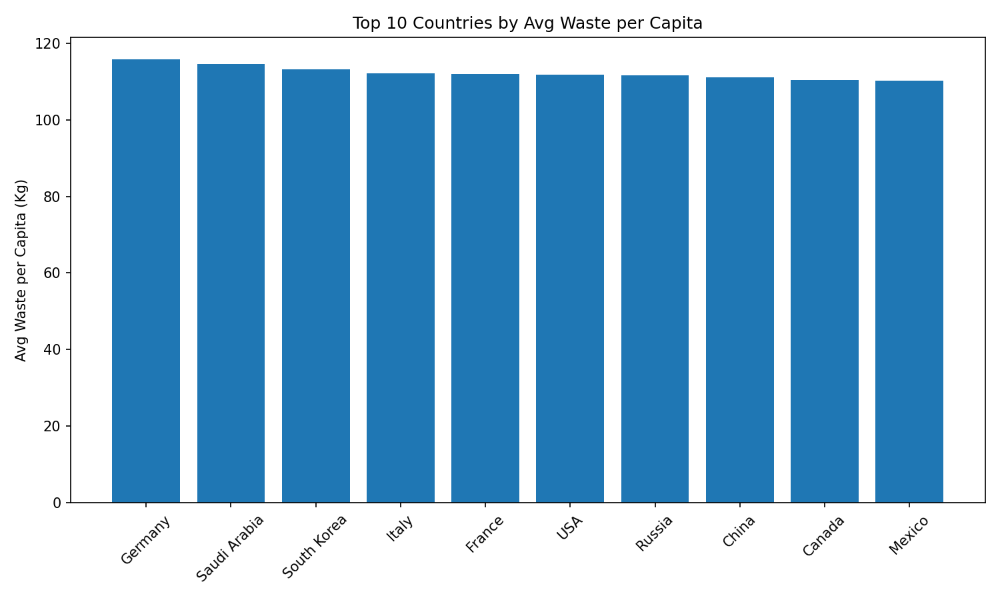
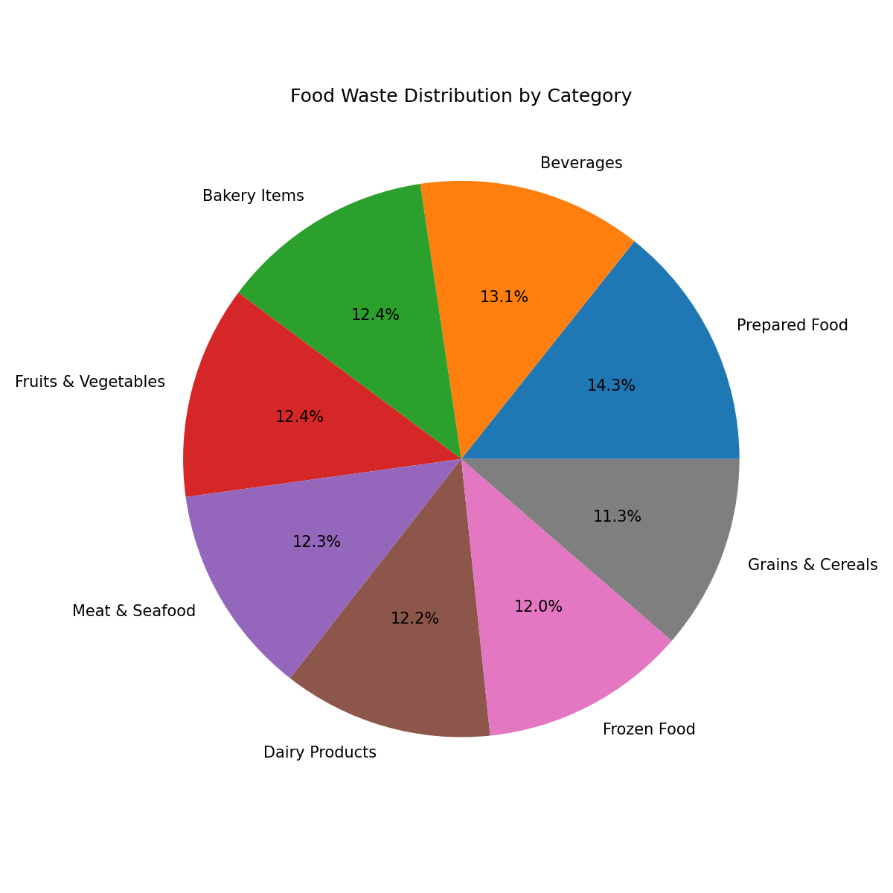
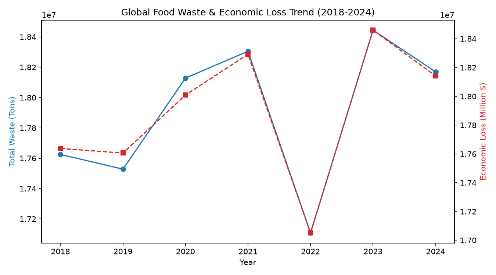
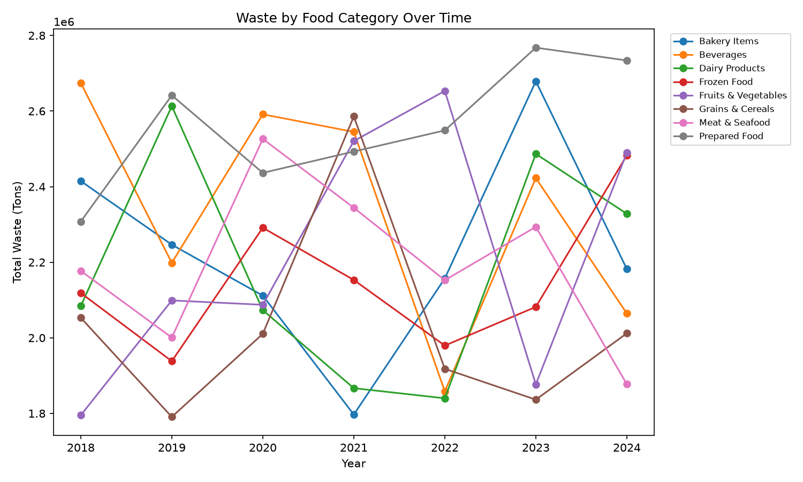
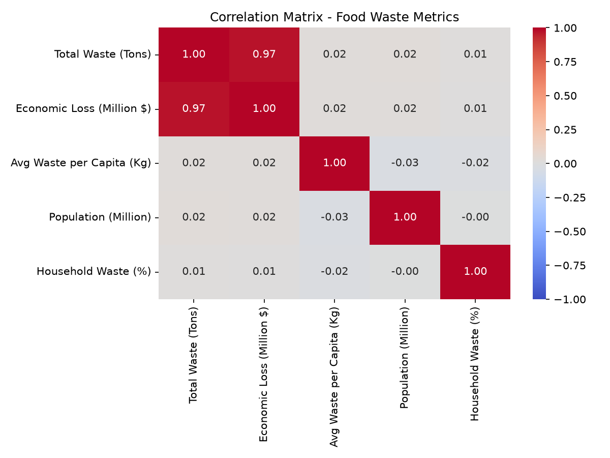
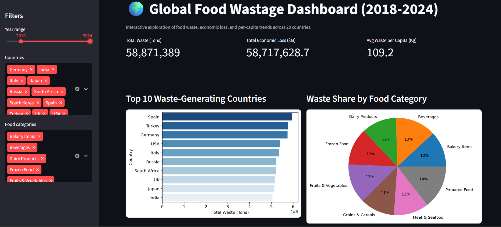

# Global Food Wastage Analysis

A Python-based data analysis project exploring food waste trends, economic losses,
and per-capita wastage data across various countries and food categories — extended
with SQL-based aggregation, trend analysis, correlation analysis, outlier detection,
and an interactive dashboard.

## 📊 Visualizations & Key Insights

### 1. Top 10 Waste Generating Countries


### 2. Waste Distribution by Food Category


### 3. Year-over-Year Waste & Economic Loss Trend (2018–2024)


### 4. Waste by Food Category Over Time


### 5. Correlation Between Key Metrics


### 6. Interactive Dashboard

*Built with Streamlit — filter by year range, country, and food category to explore the data live.*

## 🔍 Key Findings

- **Highest waste country:** Turkey, followed closely by Canada and Spain
- **Most wasteful category:** Prepared Food
- **Average global waste per capita:** ~124.6 Kg
- **Total waste and economic loss are strongly correlated (r = 0.97)** — waste volume is
  the primary driver of financial loss across countries, as expected
- **Population size shows almost no correlation with total waste (r = 0.02)** — larger
  countries don't necessarily waste proportionally more, suggesting waste is driven more
  by consumption/food-system behavior than by population scale
- **The UK is a statistical outlier** (flagged via IQR method) with a notably lower
  average waste per capita than all other countries in the dataset

## 🛠️ Methodology

- **SQL-based aggregation:** Country- and category-level summaries computed via SQL
  queries against an in-memory SQLite database (not just pandas groupby), for
  transparent and reusable aggregation logic
- **Trend analysis:** Year-over-year waste and economic loss trends, and category-level
  waste trends across 2018–2024
- **Correlation analysis:** Pearson correlation across waste, economic loss, population,
  and household waste %, visualized as a heatmap
- **Outlier detection:** IQR method applied to average waste per capita by country to
  flag statistically unusual countries
- **Interactive dashboard:** Streamlit app with year/country/category filters, live KPI
  metrics, and dynamic charts

## 🛠️ Technologies Used

- Python 3.12
- Pandas, SQLite3 (data manipulation & querying)
- Matplotlib, Seaborn (visualization)
- Streamlit (interactive dashboard)

## Files

- `foodwastage.py` — original exploratory script (top 10 countries, category breakdown)
- `sql_trend_analysis.py` — SQL aggregation, trend, correlation, and outlier analysis
- `dashboard.py` — interactive Streamlit dashboard
- `requirements.txt` — dependencies

## How to Run

```bash
pip install -r requirements.txt
python sql_trend_analysis.py --csv global_food_wastage_dataset.csv
streamlit run dashboard.py -- --csv global_food_wastage_dataset.csv
```